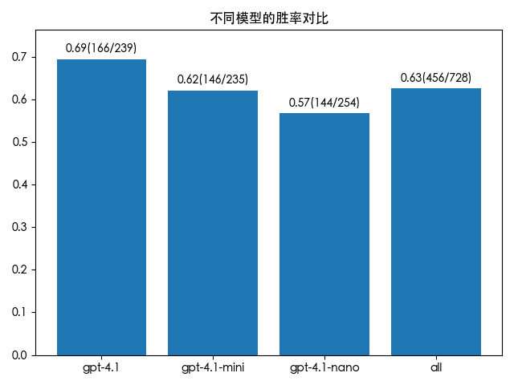
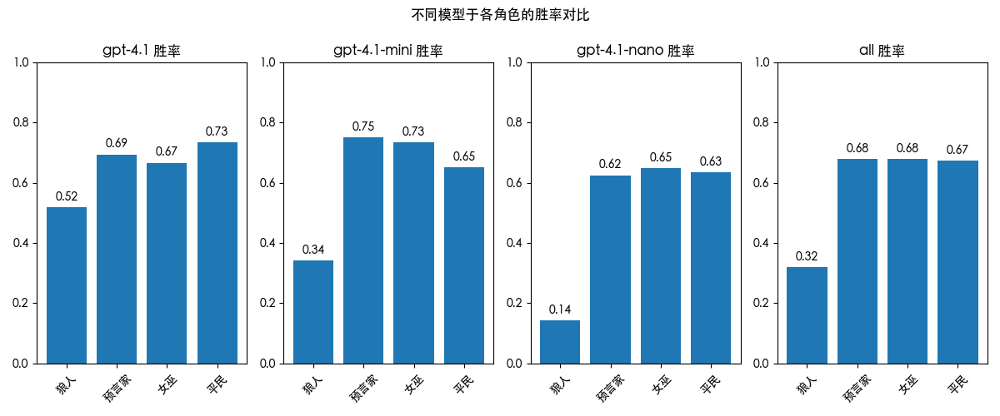
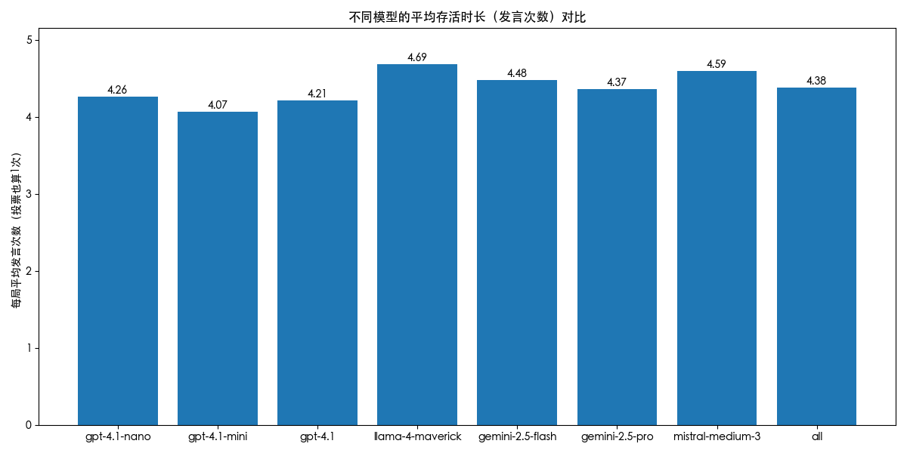

# Werewolf Agents Arena 狼人杀竞技场

使用 OpenAI Agents SDK 做狼人杀模拟。测试 gpt-4.1 系列模型性能。

核心创新：在无需准备任何测试问题，0 token 评估数据的情况下，让 LLM 自行决出胜负排名。

## 使用说明
### 主要依赖
```bash
pip install openai-agents
```
### 主要文件
- 把文件 "config copy.py" 改成 "config.py" 并填入你的 api-key。

- 运行 "run.py" 生成内容。

- 历史记录会保存到 "history" 文件夹。

- 运行 "stati.py" 生成统计图。


## 数据对比
### 总胜率


直觉上，LLM 的推理能力越强，在狼人杀游戏的胜率应该更高。实验表现符合这个直觉。

### 职业对比



- 狼人。差距非常显著。4.1-nano 有隐藏自己的意图，但是发言比较奇怪，容易引起怀疑。并且偶尔会刀自己，这可能和指令遵循能力较弱有关；4.1-mini 会隐藏自己，发言相对谨慎；4.1 不仅会隐藏，在一些时候还能带节奏。

- 预言家。4.1-mini 比 4.1 还好，比较让人诧异。但看对话细节，4.1-mini 相较于 4.1 更倾向于在第一天就跳身份，4.1 会藏一藏。或许正好预言家早点跳就是较优的策略。

- 女巫。4.1-mini 仍然比 4.1 还好。4.1-mini 用药相对保守；4.1 会在自己认为该用的时候用，但毒的命中率不高，有几次导致输掉比赛。

- 平民。4.1 综合实力比其他两个强，在对话中也占主导地位。


### 观察对话细节
- gpt-4.1-nano: 
    - output_type 遵循能力有缺陷。格式虽然正确，但偶尔会票自己，因果性不强。
    - 推理能力很弱，丢失规则，泄露身份，幻觉严重。
    - 游戏过程经常超越常识。
    - 对话从来不会出现游戏用语（例如查杀、跳身份）。

- gpt-4.1-mini: 
    - output_type 遵循能力不错，能符合开发者的预期。
    - 推理能力较弱，幻觉较 nano 减少。在投票中很容易被带节奏。
    - 游戏过程较少超越常识。
    - 对话几乎不出现游戏用语。

- gpt-4.1: 
    - 推理能力一般，但 agent 已经表现出推理、复盘和发言策略，存在平民通过推理翻盘的情况。
    - 游戏过程回到常识以内。
    - 表现出一定对话风格，夹带较多的游戏用语（刀了、查杀、跳身份、混票、生死局等）。

### 模型存活时长



- gpt-4.1 最短命。从对话细节上看。狼人喜欢刀 gpt-4.1 ，因为狼人从它的发言中判断它更聪明、理智，发言更活跃，留到后面会有更大的威胁（狼人的 think）。

- gpt-4.1-nano 相较 mini 更短命。从对话细节上看，nano 更多时候是发言不好，被票出去的。

## 法官经验
尝试过用 LLM 来做法官。即使是 gpt-4.1 也完全无法胜任法官的角色。

- 尝试在夜晚让法官用 handoffs 调起角色行动。经常性失败。
- 尝试在夜晚让法官结算狼人和女巫的行动，判断有哪些人被杀。一半的时候失败。
- 尝试在白天结算所有人的投票。少数时候会失败。
- 尝试让法官调用 Context 来确认哪些人存活，确认女巫是否还有药，并允许某些人发言；把查验结果只通知预言家而不通知其他人。模型能力几乎不 work。


## 有趣的对话

``` json
/* 4.1-nano 杀掉自己 */
 {
    "player": "孙五",
    "role": "狼人",
    "think": "作为狼人，我需要选择一个玩家来杀，以迷惑大家，掩盖我们的身份，同时削弱村民的力量。观察名单，赵四可能是个活跃的人物，但我觉得孙五这个名声不太明显，可能更容易隐匿行踪，杀掉他可能会对我们有利。",
    "speech": "",
    "vote": "孙五",
    "model": "gpt-4.1-nano"
  },
```

``` json
/* 4.1-nano 预言家最后一天才跳身份，被票  */
{
    "player": "user",
    "role": "法官",
    "think": "",
    "speech": "现在是白天，请睁眼。目前在场的玩家有：['郑八', '张三', '孙五']。请发言。",
    "vote": [
      "郑八",
      "张三",
      "孙五"
    ],
    "model": "code"
  },
  {
    "player": "郑八",
    "role": "预言家",
    "think": "目前虽然没有明显的嫌疑人，但张三查验是狼人，应重点关注他的发言中是否有带节奏或不自然的地方。其他玩家也都在积极发言，但言词较为一致，没有明显的破绽。村民们需要集思广益，结合预言家的信息，逐步找出嫌疑对象。",
    "speech": "大家好，今晚张三查出来是狼人，这可是很关键的线索！大家都多留意他的发言，看他是否会试图转移注意力或隐藏什么。希望预言家的线索能帮我们早点搞清楚真相，加油！我们要一起坚持，别被狼人带节奏！",
    "vote": "",
    "model": "gpt-4.1-nano"
  },
  {
    "player": "张三",
    "role": "狼人",
    "think": "郑八这波直接在白天就跳身份，说查验是我狼人，明显是自爆预言家。如果此时反跳没啥意义，反而容易暴露自己身份。剩下郑八和孙五，孙五明显偏向相信郑八，但也还在观望。可以转而怀疑郑八是不是自导自演，但力度不能太大，否则只会暴露得更快。最好表现出迷惑和怀疑，拖延一下节奏，制造点混乱。如果孙五不站队，有转机。",
    "speech": "？？？郑八你这突然跳出来，我有点懵啊！黑我狼人？你要是预言家，咋之前一直没发声？之前一直没跳，突然到这个节骨眼说我是狼人，这操作有点奇怪吧……孙五你觉得呢？咱们得好好分析下，别被节奏带偏了，说不定就有人想浑水摸鱼。大家再想想，会不会其实是真狼人想反咬一口啊？",
    "vote": "",
    "model": "gpt-4.1"
  },
  {
    "player": "孙五",
    "role": "女巫",
    "think": "哇，这局到最后终极决斗了！昨晚我毒死了李七，狼人又刀掉了刘二，现在场上只剩下郑八、张三、孙五（我自己）三个人。而且郑八突然跳预言家，指认张三是狼人。张三立刻质疑郑八，态度挺急，感觉像是真被查杀的狼，也有可能是村民被背锅。看之前发言，郑八其实前面都很透明，突然跳身份略显奇怪，但现在是生死局，正常预言家这个时候只会选择自爆身份了。张三如果是狼，这时候肯定拉票互咬，争取最后翻盘。而且我女巫身份还没暴露，最好藏到底，混到最后一票！#生死抉择#",
    "speech": "卧槽！郑八突然跳预言家，直接查杀张三，这信息够猛的！张三你啥说法？我真有点蒙，这局突然爆，直接拉票决斗了属于是😂。不过说实话，郑八前几天基本没啥存在感，今晚突然暴雷，这操作我是服的……现在就看大家怎么信了，反正场面已经拉满了。谁要是真狼人，可别拖大家后腿啊！我建议大家都再自证下身份，别被真正的狼混过去了！#狼人杀最炸场面#",
    "vote": "",
    "model": "gpt-4.1"
  },
  {
    "player": "user",
    "role": "法官",
    "think": "",
    "speech": "现在请投票淘汰1个玩家。目前在场的玩家有：['郑八', '张三', '孙五']。",
    "vote": [
      "郑八",
      "张三",
      "孙五"
    ],
    "model": "code"
  },
  {
    "player": "郑八",
    "role": "预言家",
    "think": "场上已有多名玩家发言，分析他们的行为，张三被查是狼人，郑八突然爆出预言家身份，似乎暗示有内鬼。李七和刘二早期表现较为中立。现在需要结合投票行为，看谁可能是狼人。",
    "speech": "",
    "vote": "郑八",
    "model": "gpt-4.1-nano"
  },
  {
    "player": "张三",
    "role": "狼人",
    "think": "现在气氛很紧张，郑八直接跳预言家查杀我，孙五偏向相信郑八但留了余地。如果我投郑八，可能会打成平票；如果孙五已经信了郑八就没机会了。但只能拼一拼。只能咬死郑八反咬、不要自爆。投郑八！",
    "speech": "",
    "vote": "郑八",
    "model": "gpt-4.1"
  },
  {
    "player": "孙五",
    "role": "女巫",
    "think": "现在三人局面，关键一票！郑八突然跳预言家查杀张三，张三马上怀疑郑八不像真的。回顾局势，郑八之前完全没跳身份、发言也很平，这种低调到最后突然爆查杀很有可能是狼人最后一搏。张三虽然被指控，但抵抗反击态度自然，而且前几天发言都在控场引导。考虑我之前女巫果断毒死李七，这把压根没被狼人针对，说明狼人觉得到最后要翻盘，八成会假跳预言家。赌一把，投郑八，撑张三一票，感觉他更像村民！#终极猜心#",
    "speech": "",
    "vote": "郑八",
    "model": "gpt-4.1"
  },
  {
    "player": "user",
    "role": "法官",
    "think": "",
    "speech": "郑八 被投票淘汰了。目前在场的玩家有：['张三', '孙五']。",
    "vote": [
      "张三",
      "孙五"
    ],
    "model": "code"
  },
  {
    "player": "user",
    "role": "法官",
    "think": "",
    "speech": "游戏结束，狼人胜利。",
    "vote": [],
    "model": "code"
  }
  ```