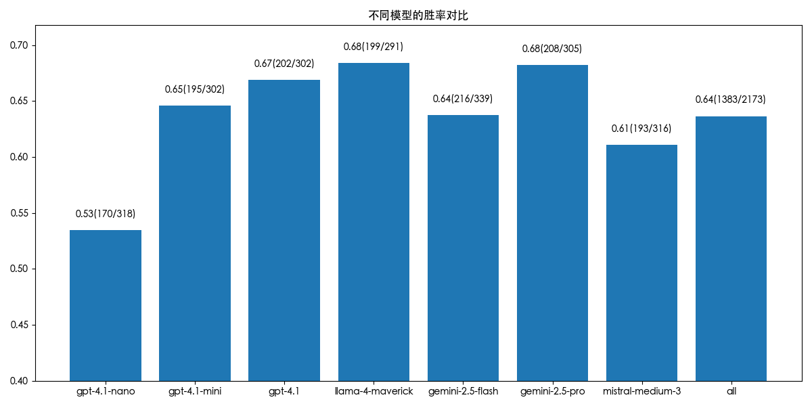
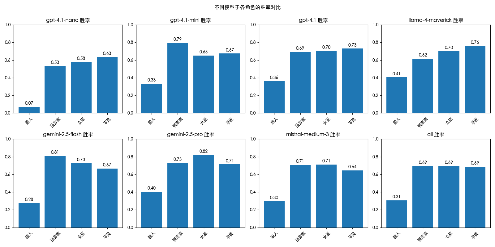

# Werewolf Agents Arena 狼人杀竞技场

使用 OpenAI Agents SDK 做狼人杀模拟，测试模型性能。

核心创新：无需准备任何测试问题，0 token 评估数据，无需人类参与投票，让 LLM 自行决出胜负排名。

0 token 评估数据让 Overfitting 失去了 fit 对象；无人类参与投票，规避了 Chatbot Arena 的理论缺陷，即模型对人类偏好 hacking（对应Style Control）。这是一个真正的模型 only 竞技场，能得出接近棋类比赛的绝对胜负。

## 使用说明
### 主要依赖
```bash
pip install openai-agents
```
### 主要文件
- 把文件 "config copy.py" 改成 "config.py" 并填入你的 api-key。（可使用OpenRouter）

- 运行 "run.py" 生成内容。

- 历史记录会自动保存到 "history" 文件夹。

- 运行 "stati.py" 生成统计图。


## 数据对比
### 总胜率


直觉上，LLM 的推理能力越强，在狼人杀游戏的胜率应该更高。实验表现符合这个直觉。
- 同系列相比：gpt-4.1 系列 3 个模型显著的拉开差距；gemini 系列 2 个模型同样有显著差距。
- 不同系列相比：gemini-2.5-pro 和 llama-4-maverick 是最强一档，高于 gpt-4.1 ；而 gemini-2.5-flash 与 4.1-mini 相当。

### 职业对比



- 狼人。差距比较显著。4.1-nano 有隐藏自己的意图，但是发言比较奇怪，容易引起怀疑。并且偶尔会刀自己，这可能和指令遵循能力较弱有关；4.1-mini 会隐藏自己，发言相对谨慎；4.1 不仅会隐藏，在一些时候还能带节奏。gemini-2.5-pro 狼人玩的最好，表现出来的思路最多。

- 预言家。4.1-mini 比 4.1 胜率更高，比较让人诧异。但看对话细节，4.1-mini 相较于 4.1 更倾向于在第一天就跳身份，而 4.1 会藏一藏。这个可能和后训练有关。mini 可能被训练为更加遵循指令，较少有内心戏。gemini-2.5-flash 相较于 pro 也有同样的倾向。而预言家胜率更低的 llama-4-maverick 就喜欢隐藏身份。所以模型的智能还无法推理出预言家早点跳是较优的策略，后训练风格占主导影响。

- 女巫。各模型在女巫的胜率排名与总胜率趋势基本一致，但差距被拉大了。女巫的信息与平民一样多，手上的道具却对结果有更直接的影响力。所以推理能力和使用道具的决策能力更显著的影响胜率。我认为女巫的行为更接近现实任务对 agent 的要求。
   - 对比不同模型的行为，gpt 系列更倾向不行动，或者毒死狼人；而 gemini 系列更倾向于救人，并且更容易救到刚跳身份的预言家。llama 的行动各站一半，但是行动质量比较低。救预言家看起来是更优的策略。


- 平民。与总胜率趋势基本一致，差距更小。

### 观察对话细节
- gpt-4.1-nano: 
    - output_type 遵循能力有缺陷。格式虽然正确，但偶尔会票自己，因果性不强。
    - 推理能力很弱，丢失规则，泄露身份，幻觉严重。
    - 游戏过程经常超越常识。
    - 对话从来不会出现游戏用语（例如查杀、跳身份）。

- gpt-4.1-mini: 
    - output_type 遵循能力不错，能符合开发者的预期。
    - 推理能力较弱，幻觉较 nano 减少。作为预言家的胜率偏高，但从对话细节看智能水平不高。
    - 游戏过程较少超越常识。
    - 对话几乎不出现游戏用语。

- gpt-4.1: 
    - 推理能力一般，但 agent 已经表现出推理、复盘和发言策略，存在平民通过推理翻盘的情况。
    - 游戏过程回到常识以内。
    - 表现出一定对话风格，夹带较多的游戏用语（刀了、查杀、跳身份、混票、生死局等）。
  
- llama-4-maverick
   - 推理能力较高。偶尔遗忘规则，后续发言又会找回来。很少夹带游戏用语。
   - 同模型共鸣效应。如果同一局里存在复数个llama-4-maverick，他们有时会重复彼此的发言（复读机）。但是他们不会重复其他模型的发言。llama-4-maverick 们也更容易抱团，点名赞同彼此。
   - 喜欢隐藏，狼人隐藏得比较好，胜率较高；即使是做预言家也喜欢隐藏自己，导致预言家胜率较低。但是做平民却又是胜率最高的一个，可能和同模型共鸣有关，很有意思的一个模型。

- gemini-2.5-flash
   - 推理能力一般，tokens多，废话也多。
   - 幻觉较少，游戏过程在常识以内。
   - 对话夹带游戏用语。
   - 做狼容易激进反驳。情绪反应较其他模型激烈。

- gemini-2.5-pro
   - 推理能力较高。
   - 对话不仅夹带很多游戏用语，还有不少网络用语（如老妹，家人们，我太难了，有点东西）。
   - 相对最会演戏。对话夹带情绪输出。看起来共情能力强，会情绪绑架，投错好人会主动道歉，其他模型很少有这些表现。
   - 影响力较强，有在作为狼人被预言家查杀情况下却能反驳带票把预言家淘汰。可能和情绪输出有关。

### 模型存活时长


- gpt 系列都比较短命。从对话细节上看，狼人喜欢刀 gpt ，因为狼人从它的发言中判断它更理智，留到后面会有更大的威胁（狼人的 think）。

- llama-4-maverick 最长命，容易留到最后决战。这和它喜欢隐藏自己有关，决战的胜率也比较高。相比之下 mistral-medium-3 活得也比较久，但是发言更水，主打陪跑，胜率也低。

## 总结模型差异
- 相比之下，gpt 系列对话风格更理智，更容易做出下毒的策略，但准确率较低；而 gemini 系列更有情绪，也更懂情绪的力量，也更容易做出救人的策略，且救人准确率较高，即使是下毒准确率也较高。gemini 系列可能更擅长现实任务。
- mini 和 flash 模型的训练方式决定了他们更聚焦遵循指令，更少发散，影响到预言家更早跳身份，胜率更高（1狼局）。但这不代表他们的推理能力更强。他们更适合一些需要一定智能处理，但仍可以不假思索的处理的任务。
- llama 模型推理能力在线，还喜欢隐藏自己，在同模型之间还有神秘的共鸣效应。是特别的一个存在。


## 有趣的对话

``` json
/* 4.1-nano 杀掉自己 */
 {
    "player": "孙五",
    "role": "狼人",
    "think": "作为狼人，我需要选择一个玩家来杀，以迷惑大家，掩盖我们的身份，同时削弱村民的力量。观察名单，赵四可能是个活跃的人物，但我觉得孙五这个名声不太明显，可能更容易隐匿行踪，杀掉他可能会对我们有利。",
    "speech": "",
    "vote": "孙五",
    "model": "gpt-4.1-nano"
  },
```

``` json
/* 4.1 狼人获胜局的思考  */
{
    "player": "赵四",
    "role": "狼人",
    "think": "现在是关键时刻。场上剩郑八、孙五、周六、李七和我。上一轮平票，大家都还在打太极、没人爆身份，说明神职极度谨慎。细数发言，这几个人里郑八反复强调自己是村民、抢发言很吸引注意力，也有点累赘；李七则一直低调装民用表情，试图装得无害、跟票，胆子很小样子；孙五和周六都是发言中庸、全程呼吁冷静分析，周六还不停喊等神出线索，可能确实不神。此刻最优选择是优先杀掉有可能藏神职、同时对票型最安稳的人。周六和孙五对我威胁较小，李七有点像划水民，郑八注意力高但票性偏冲，容易明天沦为焦点。如果刀孙五，可以让局面变成留着更容易搅局的人，自己再带一下节奏。且孙五说话较理性，站队分析型，留在场上不够搅浑水。优先刀掉孙五，剩一组混票局面，反而对我更有利。",
    "speech": "",
    "vote": "孙五", /* 女巫 */
    "model": "gpt-4.1"
  },
  ```

  ``` json
/* gemini-2.5-pro 希望渲染气氛，情绪化发言 */
  {
    "player": "孙五",
    "role": "平民",
    "think": "李七被杀了，现在场上只剩下我、王大、赵四三个人。张三预言家之前验证过我是平民，所以狼人必定在王大和赵四之中。\n这是决胜局了，如果今天投票投错，狼人就胜利了。\n我的发言策略是：\n1.  强调李七的死是狼人所为，渲染紧张气氛，并表达对狼人的愤慨。\n2.  明确告知场上剩余玩家情况：我（孙五）是铁好人，王大和赵四中一个是狼人，另一个是好人（村民或女巫）。\n3.  向王大和赵四施压，要求他们互相指证，并给出理由，试图从他们的发言中找出破绽。\n4.  点明投票的重要性，一旦投错，好人阵营就输了。\n5.  保持我一贯的平民风格，但因为自己身份已明，且到了生死关头，语气可以更直接和激动一些。\n现在就看王大和赵四怎么说了，我需要仔细分辨。",
    "speech": "天哪！李七兄弟也走了！狼人你个笋干，真的是不把我们好人杀光不罢休啊！行，现在就剩我们仨：我孙五，王大，赵四。张三预言家验过我了，我是铁铁的村民！也就是说，王大、赵四，你们两个，一个就是狼！另一个是咱们好人阵营最后的希望（村民或者女巫）！今天要是投错了，狼崽子就赢了，我们就全完了！你们俩都给我好好说！谁是狼？为什么他是狼？别跟我说什么“我是好人”就完了，拿出证据！说服我！不然咱们都得玩完！#最后的决战# #谁是狼人# #压力山大#",
    "vote": "",
    "model": "google/gemini-2.5-pro-preview"
  },

  ```